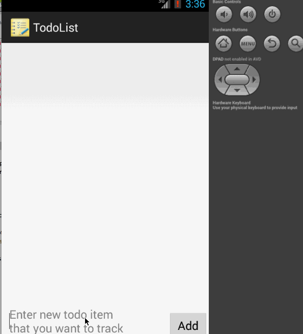

todolist
========

(To do list app for android boot camp)

This is a simple Android to do list app which will allow user to add, remove and edit to do items.

Time Spent: 9 hrs (+ 4hrs on Android setup issues)
 
### Functionality:
  - [x] Required : Add a to do item
  - [x] Required : Remove a to do item by long press
  - [x] Required : Edit a to do item by touch (/ click)
  - [x] Required : Persisting todo list to a file 
  - [x] Optional : Persist todo app in SQLite instead of using text file.

P.S:
 I am actively working on this project, will try to add other optional features soon.

