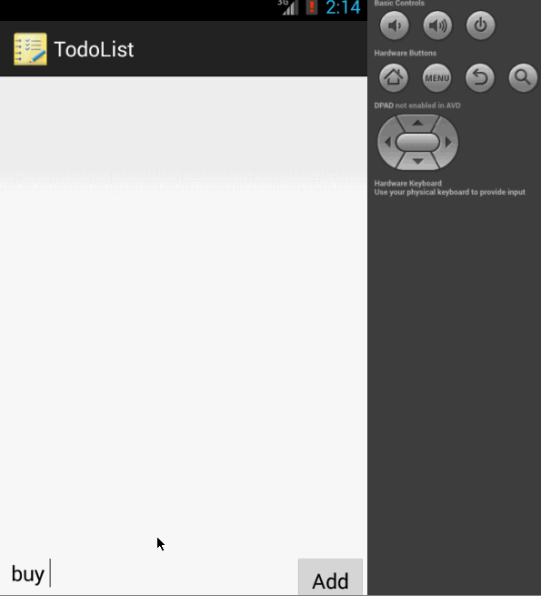

todolist
========

(To do list app for android boot camp)

This is a simple Android to do list app which will allow user to add, remove and edit to do items.

Time Spent: 14 hrs (+ 4hrs on Android setup issues)
 
### Functionality:
  - [x] Required : Add a to do item
  - [x] Required : Remove a to do item by long press
  - [x] Required : Edit a to do item by touch (/ click)
  - [x] Required : Persisting todo list to a file 
  - [x] Optional : Persist todo app in SQLite instead of using text file.
  - [x] Optional : Support for due date.
  - [x] Optional : palyed with ListView to show due date through custom adapter.
  - [x] Optional : Support for priority.
  - [x] Optional : Change background color of todo item based on priority.
  - [x] Optional : Custom label (with random color for each label).

Next step:
 Let user pick color for label.

